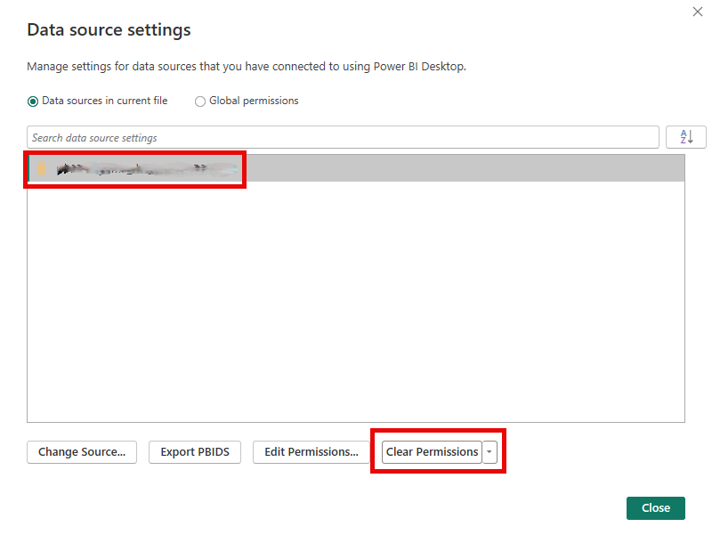

---
tags:
  - Power BI
---
# Instellen van PBI Trusted Servers

It's possible to have network issues with your on-prem enviroment and your on-prem SQL databases. Due to this reason you have to force your account to 'accept' connections without trust_certificate turned on. You shouldn't have these issues if all your data lives on the cloud.

Some people made a post about [this](https://community.fabric.microsoft.com/t5/Issues/Datasource-Error-SSL-certificate-february-release-PBI-Desktop/idi-p/3708083#comments) on the [Power BI forums](https://community.fabric.microsoft.com/t5/Power-BI-forums/ct-p/powerbi)

Users now need to setup a local variabele on their machine to make this work again. This should only be done once.

## Instructions on setting up these variables

==In the windows search bar search for:==

=== "English"

    ``` text
    Edit environment variables for your account
    ```

=== "Dutch"

    ``` text
    Omgevingsvariabele voor uw account bewerken
    ```


==Choose to make a new variable and put in the following things:==


```
PBI_SQL_TRUSTED_SERVERS
```

==and the values==

```
*server1*, *server2*, *server3*, *server4*
```


!!! info "Note"

    Make sure to add all possible database servers you have. This does not mean the individual databases, but the actual server you would connect to in SSMS.


==Restart your computer once these changes have been made==

### Delete data source permissions in old Power BI files

It's possible that you still have old reference in your Power BI files. Sometimes you will have to clear these, down below is a short instruction on how to do just that.

1. Open Power BI
2. Navigate to data sources

3. Select the data source and press clear permissions


4. Sanity check; refresh the dashboard.