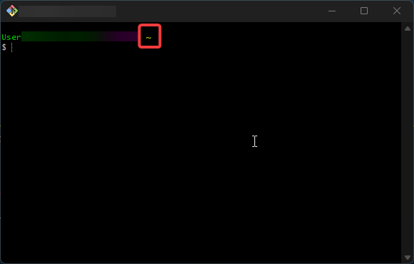
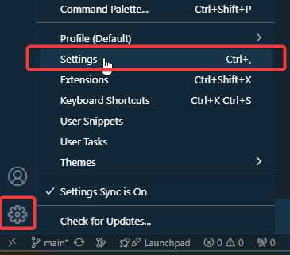
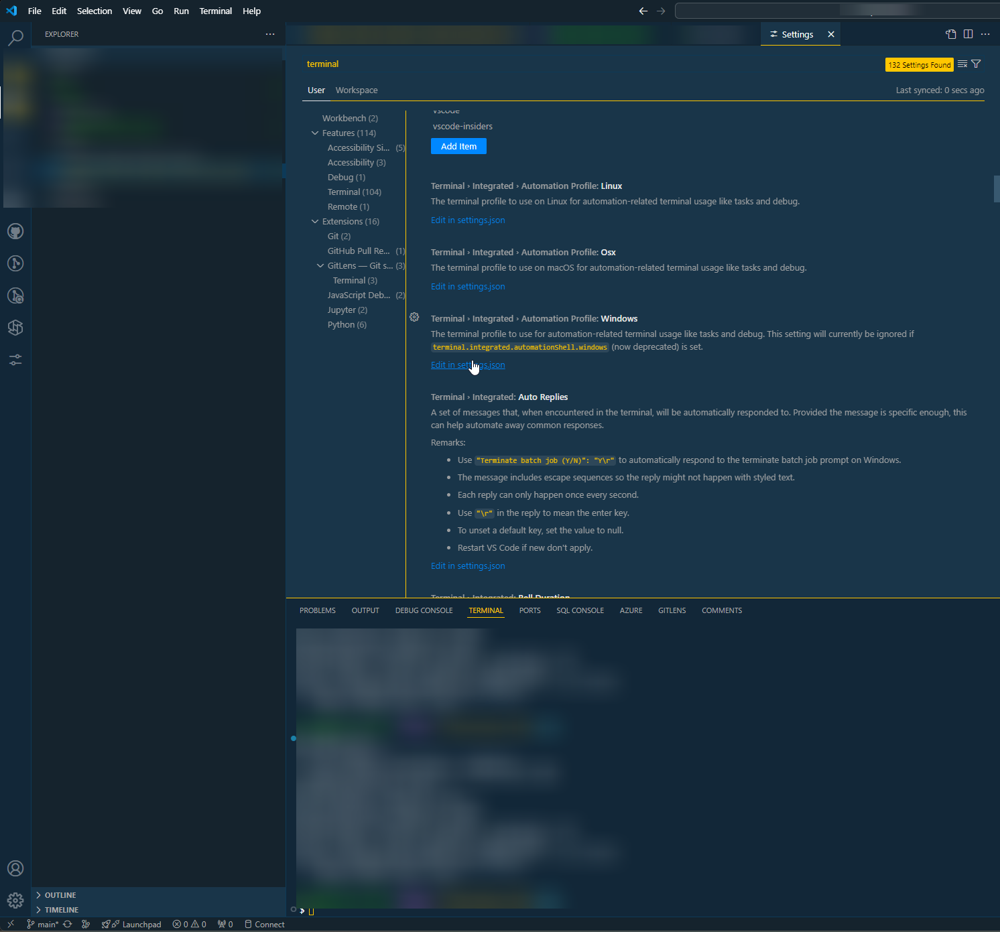

---
tags:
  - Git
---
# Creating aliases for git

This instruction manual will help you setup aliases that you can use in git. The alias we are creating in this guide today is one of my favorites which I call: Lazygit. Essentially it combines 3 commands in one, git add ., git commit -m and git push. Combining all 3 into a single action hench the name.


!!! warning "A word of caution"

    While this function is amazing for quick commits. Do be warned that it will add **everything** that has been changed to your commit.
    This is because we use the following command:

    ```bash
    git add .
    ```
    The dot in this means it will add all unstaged changes to the staging area and since we will commit these changes and push them they will become a part of your commit history. **Even though you may not want this to happen!**

## Pre-requisites

1. Knowledge of git
1. Git bash installed on your machine

---

## Instructions

Navigate to git bash using the windows search bar or any other preferred method.


Make sure you are in the root directory as shown in the image or alternatively run:

```bash
cd ~
```



Run the following command to create the *.bash_profile* file. It may already exist for you, if so, you can skip this step.

```bash
touch .bash_profile
```

Either navigate to the file or type:

```bash
nano .bash_profile
```

This will open the file with a nano editor. From here you can paste the following code:

```bash
function lazygit() {
    git add .
    git commit -m "$1"
    git push
}
```

Save the file with ctrl + s and exit nano with ctrl + x.
With your file now saved you are almost ready to utilize your new function! We simply need to give our git bash a one time instruction.

```bash
source ~/.bash_profile
```

Finally you can now use your function! Make some changes to your repository and run the following command:

```bash
lazygit "Adding a nice commit message"
```

This will run our created function. So it will add **all** changes, commit them with your message and finally push it back to the remote repository

---

### Getting this to work in VS-Code

I didn't really figure this out myself, I did a bit of googling and stumbled upon this [extremely useful stackoverflow discussion.](https://stackoverflow.com/questions/51820921/vscode-integrated-terminal-doesnt-load-bashrc-or-bash-profile)

Essentially we need to add the following code to our settings in VS-Code

```JSON
"terminal.integrated.defaultProfile.windows": "Git Bash",
"terminal.integrated.profiles.windows": {
    "Git Bash": {
      "path": [ "C:\\Program Files\\Git\\bin\\bash.exe" ],
      "args": [ "--login" ]
    }
}
```

Navigate to your settings and then paste the code above in the settings and save:





Now when you run a **new** terminal session your .bash_profile settings should work. Which includes our just created function!

.bash_profile is a pretty useful file. It allows you to set much and much more, I would highly recommend googling a few git aliases to get inspiration on useful aliases for your workflow.