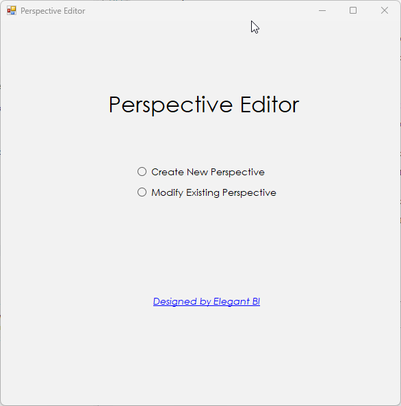
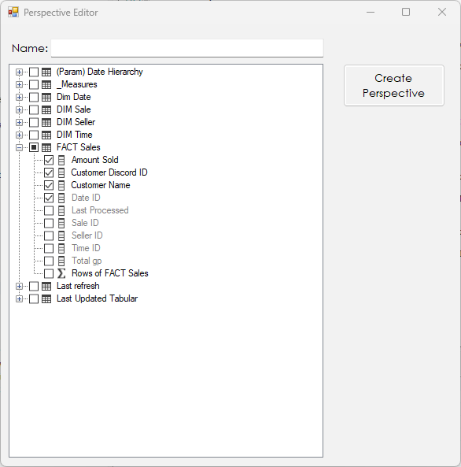

# UI friendly perspective editor

The script below generates a nice and easy way to edit perspectives using [Tabular Editor 2.](../../knowledge/Tabular Editor 2.md) Tabular Editor 3 has an inbuild editor to use so if your organisation has a Tabular Editor 3 license it's not needed.

## Sample images



## Script
```C# title="C# script that creates a friendly UI to edit perspectives in" linenums="1"
#r "System.Drawing"

using System.Drawing;

// Create elements
System.Windows.Forms.Form newForm = new System.Windows.Forms.Form();
System.Windows.Forms.Panel newPanel = new System.Windows.Forms.Panel();
System.Windows.Forms.Label toolLabel = new System.Windows.Forms.Label();
System.Windows.Forms.TreeView treeView = new System.Windows.Forms.TreeView();
System.Windows.Forms.Button createButton = new System.Windows.Forms.Button();
System.Windows.Forms.TextBox enterTextBox = new System.Windows.Forms.TextBox();
System.Windows.Forms.Label nameLabel = new System.Windows.Forms.Label();
System.Windows.Forms.ImageList imageList = new System.Windows.Forms.ImageList();
System.Windows.Forms.RadioButton newmodelButton = new System.Windows.Forms.RadioButton();
System.Windows.Forms.RadioButton existingmodelButton = new System.Windows.Forms.RadioButton();
System.Windows.Forms.Button goButton = new System.Windows.Forms.Button();
System.Windows.Forms.ComboBox enterComboBox = new System.Windows.Forms.ComboBox();
System.Net.WebClient w = new System.Net.WebClient();
System.Windows.Forms.LinkLabel ebiHome = new System.Windows.Forms.LinkLabel();

// Colors
System.Drawing.Color visibleColor = Color.Black;
System.Drawing.Color hiddenColor = Color.Gray;
System.Drawing.Color bkgrdColor =  ColorTranslator.FromHtml("#F2F2F2");
System.Drawing.Color darkblackColor =  ColorTranslator.FromHtml("#0D1117");
System.Drawing.Color darkgrayColor =  ColorTranslator.FromHtml("#21262D");
System.Drawing.Color lightgrayColor =  ColorTranslator.FromHtml("#C9D1D9");

// Fonts
string fontName = "Century Gothic";
System.Drawing.Font homeToolNameFont = new Font(fontName, 24);
System.Drawing.Font stdFont = new Font(fontName, 10);
System.Drawing.Font elegantFont = new Font(fontName, 10, FontStyle.Italic);

// Add images from web to Image List
string urlPrefix = "https://github.com/m-kovalsky/Tabular/raw/master/Icons/";
string urlSuffix = "Icon.png";
string toolName = "Perspective Editor";
string ebiURL = @"https://www.elegantbi.com";

string[] imageURLList = { "Table", "Column", "Measure", "Hierarchy" };
for (int b = 0; b < imageURLList.Count(); b++)
{
    string url = urlPrefix + imageURLList[b] + urlSuffix;      
    byte[] imageByte = w.DownloadData(url);
    System.IO.MemoryStream ms = new System.IO.MemoryStream(imageByte);
    System.Drawing.Image im = System.Drawing.Image.FromStream(ms);
    imageList.Images.Add(im);
}    
    
// Images
treeView.ImageList = imageList;
treeView.ImageIndex = 0;   
imageList.ImageSize = new Size(16, 16);   
     
// Form
newForm.Text = toolName;
int formWidth = 600;
int formHeight = 600;
newForm.TopLevel = true;
newForm.Size = new Size(formWidth,formHeight);
newForm.Controls.Add(newPanel);
newForm.BackColor = bkgrdColor;
newForm.MaximumSize = new Size(formWidth,formHeight);
newForm.MinimumSize = new Size(formWidth,formHeight);

// Panel
newPanel.Size = new Size(formWidth,formHeight);
newPanel.Location =  new Point(0, 0);
newPanel.BorderStyle = System.Windows.Forms.BorderStyle.None;
newPanel.BackColor = bkgrdColor;
newPanel.Controls.Add(treeView);
newPanel.Controls.Add(createButton);
newPanel.Controls.Add(enterTextBox);
newPanel.Controls.Add(nameLabel);
newPanel.Visible = false;

// TreeView
int treeViewWidth = formWidth * 2 / 3;
int treeViewHeight = formHeight - 100;
int treeViewX = 10;
int treeViewY = 50;
treeView.CheckBoxes = false;
treeView.Size = new Size(treeViewWidth,treeViewHeight);
treeView.Location = new Point(treeViewX,treeViewY);
treeView.StateImageList = new System.Windows.Forms.ImageList();
treeView.Visible = false;
bool IsExpOrCol = false;
string perspName = string.Empty;

// Add images for tri-state tree view
string[] stateimageURLList = { "Unchecked", "Checked", "PartiallyChecked" };
for (int c = 0; c < stateimageURLList.Count(); c++)
{
    var url = urlPrefix + stateimageURLList[c] + urlSuffix;      
    byte[] imageByte = w.DownloadData(url);
    System.IO.MemoryStream ms = new System.IO.MemoryStream(imageByte);
    System.Drawing.Image im = System.Drawing.Image.FromStream(ms);
    treeView.StateImageList.Images.Add(im);
}  
            
// Create Button
createButton.Size = new Size(130,55);
createButton.Location = new Point(treeViewWidth + 35,treeViewY);
createButton.Text = "Create Perspective";
createButton.Visible = false;
createButton.Font = stdFont;

int startScreenX = 200;
int startScreenY = 200;

toolLabel.Size = new Size(300,60);
toolLabel.Text = toolName;
toolLabel.Location = new Point(150,100);
toolLabel.Font = homeToolNameFont;
toolLabel.ForeColor = visibleColor;

// New Model Button
newmodelButton.Size = new Size(250,40);
newmodelButton.Location = new Point(startScreenX,startScreenY);
newmodelButton.Text = "Create New Perspective";
newmodelButton.Font = stdFont;

// Existing Model Button
existingmodelButton.Size = new Size(250,40);
existingmodelButton.Location = new Point(startScreenX,startScreenY+30);
existingmodelButton.Text = "Modify Existing Perspective";
existingmodelButton.Font = stdFont;

// Enter Combo Box
enterComboBox.Visible = false;
enterComboBox.Size = new Size(215,40);
enterComboBox.Location = new Point(startScreenX-10,startScreenY+80);
enterComboBox.Font = stdFont;

// Add items to combo box
foreach (var p in Model.Perspectives.ToList())
{
    string pName = p.Name;
    enterComboBox.Items.Add(pName);
}

// New Model Button
goButton.Size = new Size(140,30);
goButton.Location = new Point(startScreenX+80,startScreenY+80);
goButton.Text = "Go";
goButton.Font = stdFont;
goButton.Visible = false;
goButton.Enabled = false; 

// Add starting elements to form
newForm.Controls.Add(newmodelButton);
newForm.Controls.Add(existingmodelButton);
newForm.Controls.Add(enterComboBox);
newForm.Controls.Add(goButton);
newForm.Controls.Add(toolLabel);
newForm.Controls.Add(ebiHome);

ebiHome.Text = "Designed by Elegant BI";
ebiHome.Size = new Size(200,40);
ebiHome.Location = new Point(220,400);
ebiHome.Font = elegantFont;

ebiHome.LinkClicked += (System.Object sender, System.Windows.Forms.LinkLabelLinkClickedEventArgs e) => {

    System.Diagnostics.Process.Start(ebiURL);
};

// Label
nameLabel.Size = new Size(60,40);
nameLabel.Location = new Point(treeViewX,20);
nameLabel.Text = "Name:";
nameLabel.Font = stdFont;
nameLabel.Visible = false;

// Text box
enterTextBox.Size = new Size(348,40);
enterTextBox.Location = new Point(63,18);
enterTextBox.Visible = false;
enterTextBox.Font = stdFont;

// Add nodes to treeview
foreach (var t in Model.Tables.OrderBy(a => a.Name).ToList())
{  
    // Add table nodes
    string tableName = t.Name;    
    var tn = treeView.Nodes.Add(tableName);    
    tn.StateImageIndex = 0;
    tn.ImageIndex = 0;
    tn.SelectedImageIndex = 0;
    
    if (t.IsHidden)
    {
        tn.ForeColor = hiddenColor;
    }
    
    // Add column sub-nodes
    foreach (var c in t.Columns.OrderBy(a => a.Name).ToList())
    {
        string columnName = c.Name;
        var x = tn.Nodes.Add(columnName);        
        x.StateImageIndex = 0;
        x.ImageIndex = 1;        
        x.SelectedImageIndex = 1;
        
        if (c.IsHidden)
        {
            x.ForeColor = hiddenColor;
        }
    }
    
    // Add measure sub-nodes
    foreach (var m in t.Measures.OrderBy(a => a.Name).ToList())
    {
        string measureName = m.Name;
        var x = tn.Nodes.Add(measureName);
        x.StateImageIndex = 0;
        x.ImageIndex = 2;        
        x.SelectedImageIndex = 2;
        
        if (m.IsHidden)
        {
            x.ForeColor = hiddenColor;
        }
    }   
   
    // Add hierarchy sub-nodes
    foreach (var h in t.Hierarchies.OrderBy(a => a.Name).ToList())
    {
        string hierarchyName = h.Name;
        var x = tn.Nodes.Add(hierarchyName);
         x.ImageIndex = 3;
         x.StateImageIndex = 0;
         x.SelectedImageIndex = 3;
         
        if (h.IsHidden)
        {
            x.ForeColor = hiddenColor;
        }
    }    
}

newmodelButton.Click += (System.Object sender1, System.EventArgs e1) => {

    goButton.Visible = true;
    existingmodelButton.Checked = false;
    newmodelButton.Checked = true;
    goButton.Location = new Point(startScreenX+25, startScreenY+80);
    enterComboBox.Visible = false;
    goButton.Enabled = true;
    enterComboBox.Text = string.Empty;
    createButton.Text = "Create Perspective";   
    enterTextBox.Enabled = true;
};

existingmodelButton.Click += (System.Object sender2, System.EventArgs e2) => {

    goButton.Location = new Point(startScreenX+25, startScreenY+120);
    enterComboBox.Visible = true;
    goButton.Visible = true;    
    newmodelButton.Checked = false;
    existingmodelButton.Checked = true;  
    createButton.Text = "Modify Perspective";    
    enterTextBox.Enabled = false;
    
    // Add items to combo box
    enterComboBox.Items.Clear();
    foreach (var p in Model.Perspectives.ToList())
    {
        string pName = p.Name;
        enterComboBox.Items.Add(pName);
    }
    
    if (enterComboBox.SelectedItem == null)
    {
        goButton.Enabled = false;
    }
};

enterComboBox.SelectedValueChanged += (System.Object sender3, System.EventArgs e3) => {

    goButton.Enabled = true;         
};

goButton.Click += (System.Object sender4, System.EventArgs e4) => {

    // Hide initial buttons    
    newmodelButton.Visible = false;
    existingmodelButton.Visible = false;    
    enterComboBox.Visible = false;
    goButton.Visible = false;
    toolLabel.Visible = false;
    ebiHome.Visible = false;
    
    string p = enterComboBox.Text;
    
    // Make panel items visible
    newPanel.Visible = true;
    createButton.Visible = true;
    treeView.Visible = true;
    nameLabel.Visible = true;
    enterTextBox.Visible = true;
    
    // Populate tree from perspective if modifying existing mini model
    if (p != string.Empty)
    {
        enterTextBox.Text = p;
     
        foreach (System.Windows.Forms.TreeNode rootNode in treeView.Nodes)
        {
             string tableName = rootNode.Text;
             int childNodeCount = rootNode.Nodes.Count;
             int childNodeCheckedCount = 0;

             // Loop through checked child nodes (columns, measures, hierarchies)
             foreach (System.Windows.Forms.TreeNode childNode in rootNode.Nodes)
             {
                 var objectName = childNode.Text;
                 
                 if (childNode.ImageIndex == 1)
                 {
                     if (Model.Tables[tableName].Columns[objectName].InPerspective[p] == true)
                     {
                         childNode.StateImageIndex = 1;
                     }
                 }
                 else if (childNode.ImageIndex == 2)
                 {
                     if (Model.Tables[tableName].Measures[objectName].InPerspective[p] == true)
                     {
                         childNode.StateImageIndex = 1;
                     }
                 }
                 else if (childNode.ImageIndex == 3)
                 {
                     if (Model.Tables[tableName].Hierarchies[objectName].InPerspective[p] == true)
                     {
                         childNode.StateImageIndex = 1;
                     }
                 }
                 
                 if (childNode.StateImageIndex == 1)
                 {
                    childNodeCheckedCount+=1;
                 }
            }
             
            // Finish populating tree root nodes (tables)
            // If all child nodes are checked, set parent node to checked
            if (childNodeCheckedCount == childNodeCount)
            {
                rootNode.StateImageIndex = 1;
            }
            // If no child nodes are checked, set parent node to unchecked
            else if (childNodeCheckedCount == 0)
            {
                rootNode.StateImageIndex = 0;
            }
            // If not all children nodes are selected, set parent node to partially checked icon
            else if (childNodeCheckedCount < childNodeCount)
            {
                rootNode.StateImageIndex = 2;
            }
         }
     }                      
};

treeView.NodeMouseClick += (System.Object sender, System.Windows.Forms.TreeNodeMouseClickEventArgs e) => {
    
    if (IsExpOrCol == false)
    {
        if (e.Node.StateImageIndex != 1)
        {
            e.Node.StateImageIndex = 1;
        }
        else if (e.Node.StateImageIndex == 1)
        {
            e.Node.StateImageIndex = 0;
        }
        
        // If parent node is checked, check all child nodes
        if (e.Node.Nodes.Count > 0 && e.Node.StateImageIndex == 1)
        {
            foreach (System.Windows.Forms.TreeNode childNode in e.Node.Nodes)
            {
                childNode.StateImageIndex = 1;
            }
        }       
        
        // If parent node is unhecked, uncheck all child nodes
        else if (e.Node.Nodes.Count > 0 && e.Node.StateImageIndex == 0)
        {
            foreach (System.Windows.Forms.TreeNode childNode in e.Node.Nodes)
            {
                childNode.StateImageIndex = 0;
            }
        }
        
        if (e.Node.Parent != null)
        {
            int childNodeCount = e.Node.Parent.Nodes.Count;   
            int childNodeCheckedCount = 0;    
        
            foreach (System.Windows.Forms.TreeNode n in e.Node.Parent.Nodes)
            {
                if (n.StateImageIndex == 1)
                {
                    childNodeCheckedCount+=1;
                }
            }
            
            // If all child nodes are checked, set parent node to checked
            if (childNodeCheckedCount == childNodeCount)
            {
                e.Node.Parent.StateImageIndex = 1;
            }
            // If no child nodes are checked, set parent node to unchecked
            else if (childNodeCheckedCount == 0)
            {
                e.Node.Parent.StateImageIndex = 0;
            }
            // If not all children nodes are selected, set parent node to partially checked icon
            else if (childNodeCheckedCount < childNodeCount)
            {
                e.Node.Parent.StateImageIndex = 2;
            }
        }   
    }
    
    IsExpOrCol = false;
};

treeView.AfterExpand += (System.Object sender9, System.Windows.Forms.TreeViewEventArgs e9) => {
    
    IsExpOrCol = true;
};

treeView.AfterCollapse += (System.Object sender10, System.Windows.Forms.TreeViewEventArgs e10) => {
    
    IsExpOrCol = true;
};

createButton.Click += (System.Object sender6, System.EventArgs e6) => {
   
     perspName = enterTextBox.Text;     
     
     if (perspName == string.Empty)
     {
         // Invalid perspective name
         Error("Please enter a name for the new perspective.");
     }
     else
     {
         if (!Model.Perspectives.Any(a => a.Name == perspName))
         {
             // Create new perspective
             Model.AddPerspective(perspName);
         }

         // Clear perspective
         foreach (var t in Model.Tables.ToList())
         {
             string tableName = t.Name;             
             Model.Tables[tableName].InPerspective[perspName] = false;
         }
         
         // Loop through root nodes (tables)
         foreach (System.Windows.Forms.TreeNode rootNode in treeView.Nodes)
         {
             string tableName = rootNode.Text;
         
             // Loop through checked child nodes (columns, measures, hierarchies)
             foreach (System.Windows.Forms.TreeNode childNode in rootNode.Nodes)
             {
                 string objectName = childNode.Text;
                 
                 if (childNode.StateImageIndex == 1)
                 {
                     // Columns
                     if (childNode.ImageIndex == 1)                    
                     {
                         Model.Tables[tableName].Columns[objectName].InPerspective[perspName] = true;                                              
                     }                    
                     // Measures
                     else if (childNode.ImageIndex == 2)                    
                     {
                         Model.Tables[tableName].Measures[objectName].InPerspective[perspName] = true;                                            
                     }
                     // Hierarchies
                     else if (childNode.ImageIndex == 3)                    
                     {
                         Model.Tables[tableName].Hierarchies[objectName].InPerspective[perspName] = true;
                     }
                 }
             }
         }
     }        
};

newForm.Show();
```
