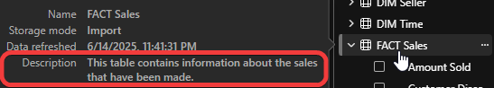
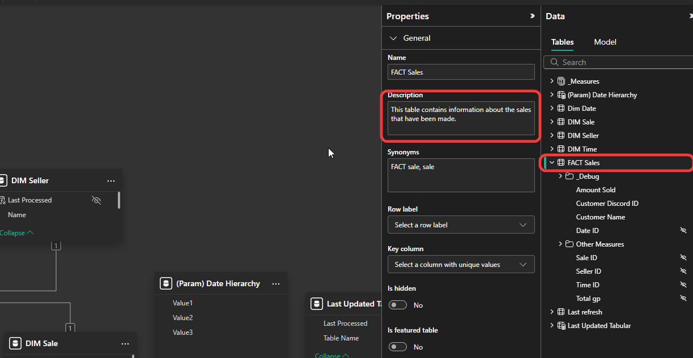

# Output model objects descriptions

This C# script outputs the descriptions of all the objects in a semantic model. Extremely useful for documentation purposes. The descriptions we are talking about can be found by hovering over an object in Power BI 

## Showcase

 

or in the model view of Power BI 



## Script

```C# title="C# script that outputs all model objects description to a delimted file" linenums="1"
// Construct a list of all visible columns and measures:
var objects = Model.AllMeasures.Where(m => !m.IsHidden && !m.Table.IsHidden).Cast<ITabularNamedObject>()
      .Concat(Model.AllColumns.Where(c => !c.IsHidden && !c.Table.IsHidden));

// Get their properties in TSV format (tabulator-separated):
var tsv = ExportProperties(objects,"Name,ObjectType,Parent,Description,FormatString,DataType,Expression");

// (Optional) Output to screen (can then be copy-pasted into Excel):
// tsv.Output();

// ...or save the TSV to a file:
SaveFile("documentation.tsv", tsv);
```
